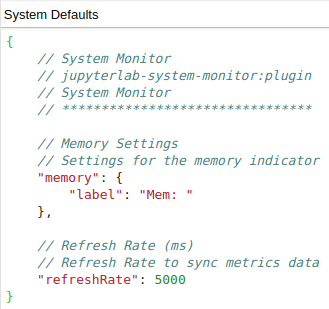

# JupyterLab System Monitor


[](https://mybinder.org/v2/gh/jtpio/jupyterlab-system-monitor/stable?urlpath=lab)

JupyterLab extension to display system information (memory and cpu usage).

Provides an alternative frontend for the `nbresuse` metrics: [https://github.com/yuvipanda/nbresuse](https://github.com/yuvipanda/nbresuse)


This extension was originally developed as part of the [jupyterlab-topbar](https://github.com/jtpio/jupyterlab-topbar) project, and extracted into its own repository later on.

## TODO

- Add Network I/O
- Expose more settings

## Prerequisites

- JupyterLab 1.0+
- Node.js

## Installation

This extension requires the `nbresuse` package and the `jupyterlab-topbar-extension` extension for JupyterLab.

**Note: This extension is not compatible with `nbresuse==0.3.4`**.

Starting from JupyterLab 3.0, extensions can be distributed as a Python package. Installation instructions will differ depending on your version of JupyterLab:

### JupyterLab 3.x

```bash
pip install jupyterlab-system-monitor
```

### JupyterLab 2.x

```bash
pip install nbresuse
jupyter labextension install jupyterlab-topbar-extension jupyterlab-system-monitor
```

`nbresuse` can also be installed with `conda`:

```bash
conda install -c conda-forge nbresuse
```

Note: Node.js is required to install JupyterLab extensions. It can be installed with `conda`:

```bash
conda install -c conda-forge nodejs
```

## Configuration

### Graphic Display

You can set the memory and cpu limits (but not enforce it) to display the indicator in the top bar.

For more info, check the [memory limit](https://github.com/yuvipanda/nbresuse#memory-limit) in the [nbresuse](https://github.com/yuvipanda/nbresuse) repository.

Edit `~/.jupyter/jupyter_notebook_config.py` (note: see [here](https://jupyter-notebook.readthedocs.io/en/stable/config.html#config-file-and-command-line-options) if you do not have a config file:

```python
c = get_config()

# memory
c.NotebookApp.ResourceUseDisplay.mem_limit = <size_in_GB> *1024*1024*1024

# cpu
c.NotebookApp.ResourceUseDisplay.track_cpu_percent = True
c.NotebookApp.ResourceUseDisplay.cpu_limit = <number_of_cpus>
```

For example:

```python
c.NotebookApp.ResourceUseDisplay.mem_limit = 4294967296
c.NotebookApp.ResourceUseDisplay.track_cpu_percent = True
c.NotebookApp.ResourceUseDisplay.cpu_limit = 2
```

Or use the command line option:

```bash
# POSIX shell
jupyter lab --NotebookApp.ResourceUseDisplay.mem_limit=$(( size_in_GB *1024*1024*1024)) \
            --NotebookApp.ResourceUseDisplay.track_cpu_percent=True \
            --NotebookApp.ResourceUseDisplay.cpu_limit=$(( number_of_cpus ))
```

### Advanced Settings

You can change the label and refresh rate in JupyterLab's advanced settings editor:



## Troubleshooting

If you are experiencing issues with the memory and cpu indicators not being displayed, make sure to check the [nbresuse changelog](https://github.com/yuvipanda/nbresuse/blob/master/CHANGELOG.md) for any breaking changes from major releases.

## Development

```bash
# create a new conda environment
conda create -n jupyterlab-system-monitor -c conda-forge jupyterlab nodejs nbresuse
conda activate jupyterlab-system-monitor

# Install dependencies
jlpm

# Install the package in development mode
pip install -e .

# Link your development version of the extension with JupyterLab
jlpm run develop

# Rebuild extension TypeScript source after making changes
jlpm run build
```

### Uninstall

```bash
pip uninstall jupyterlab-system-monitor
```
