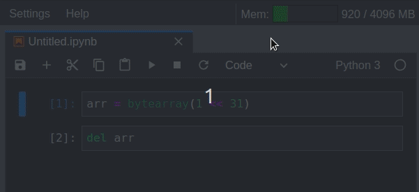

# JupyterLab System Monitor

[](https://mybinder.org/v2/gh/jtpio/jupyterlab-system-monitor/stable?urlpath=lab)

JupyterLab extension to display system information (memory and cpu usage).

Provides an alternative frontend for the `nbresuse` metrics: [https://github.com/yuvipanda/nbresuse](https://github.com/yuvipanda/nbresuse)



This extension was originally developed as part of the [jupyterlab-topbar](https://github.com/jtpio/jupyterlab-topbar) project, and extracted into its own repository later on.

## TODO

- Add CPU usage
- Add Network I/O
- Expose more settings

## Prerequisites

- JupyterLab 1.0

## Installation

This extension requires the `nbresuse` package and the `jupyterlab-topbar-extension` extension for JupyterLab.

```bash
pip install nbresuse
jupyter labextension install jupyterlab-topbar-extension jupyterlab-system-monitor
```

## Development

```bash
# create a new conda environment
conda create -n jupyterlab-system-monitor jupyterlab nodejs
conda activate jupyterlab-system-monitor

# package to retrieve the system metrics
python -m pip install nbresuse

# required to place indicators in the top area
jupyter labextension install jupyterlab-topbar-extension

# local install of the extension
jupyter labextension install .
```
